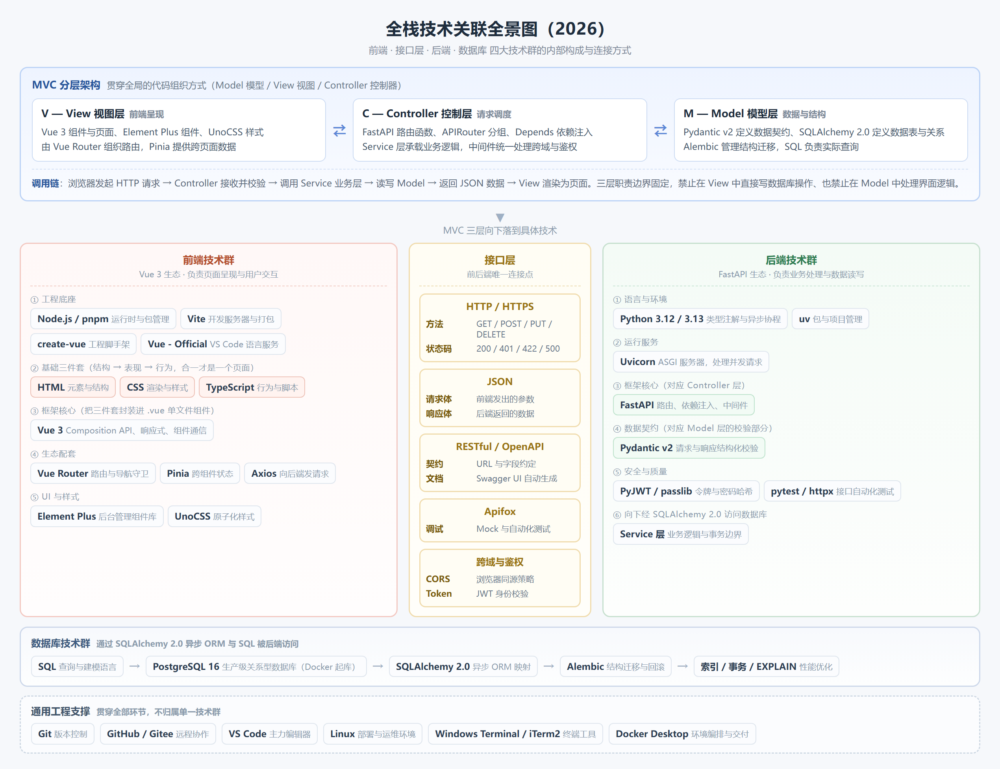

<div align="center">

# 全栈开发技术栈学习

### 面向 AI 协作时代的全栈技术地图

**知道该让 AI 做什么，也知道如何判断它是否做完整。**

20 节主线课程 · 1 篇概念专题 · Vue 3 × FastAPI × PostgreSQL

</div>

## 为什么有这个项目

AI 已能承担大量常规编码工作，让开发者更快进入项目。但写代码变快，不代表项目自然完整：如果开发者不知道鉴权、数据归属、输入校验、数据库迁移或测试这些环节，就很难在指令中提出要求，也难以发现 AI 遗漏了它们。

这个项目希望帮助全栈开发者建立**足够指导和审查 AI 的技术认知**。不以手写每个框架 API、钻研底层源码为目标，而是快速弄清每项技术的用途、在项目中的位置、与其他技术的连接、常见边界，以及怎样验证实现。最终能更高效地参与开发，也能在面试中讲清自己的判断。

适合已有基本代码阅读能力、希望快速接手 Vue 3 + FastAPI 项目的人：先建立全局技术地图，再对当前任务按需深入，减少漫无目的的学习和反复返工。

> AI 可以加速实现；需求理解、安全边界、质量判断与交付责任仍由开发者承担。

## 技术关联全景图

<a href="./学习文档/assets/技术关联全景图-大纲2026.png"></a>

<sub>点击图片可放大。图摘自《全栈开发学习大纲 2026（技术版）》· CosineLab；图中的版本与具体库名是原大纲示意，学习时以课程正文和项目实际依赖为准。</sub>

## 学习路线

按顺序阅读，先建立完整链路，再按手头项目回查需要的章节：

- **01—03 · 架构与通信：** [MVC 分层](./学习文档/01-MVC分层架构.md) · [HTTP 与 HTTPS](./学习文档/02-HTTP与HTTPS.md) · [JSON](./学习文档/03-JSON数据格式.md)
- **04—09 · 前端开发：** [HTML 与 CSS](./学习文档/04-HTML与CSS页面基础.md) · [TypeScript](./学习文档/05-TypeScript基础与类型系统.md) · [Node.js、pnpm 与 Vite](./学习文档/06-Node.js、pnpm、Vite与create-vue工程化.md) · [Vue 3](./学习文档/07-Vue3核心基础与组件化.md) · [Router 与 Pinia](./学习文档/08-Vue-Router与Pinia.md) · [Axios 与接口层](./学习文档/09-Axios与前后端接口层.md)
- **10—13 · 后端与数据：** [Python](./学习文档/10-Python现代语法与后端开发基础.md) · [FastAPI 与 Pydantic](./学习文档/11-FastAPI、Pydantic与依赖注入.md) · [SQL](./学习文档/12-SQL与关系型数据库基础.md) · [PostgreSQL、SQLAlchemy 与 Alembic](./学习文档/13-PostgreSQL、SQLAlchemy与Alembic.md)
- **14—17 · 运行与协作：** [Docker 与 Compose](./学习文档/14-Docker与Compose应用容器化.md) · [Linux 与 VS Code](./学习文档/15-Linux终端与VS-Code开发环境.md) · [Git 与 CI](./学习文档/16-Git代码协作与持续集成.md) · [uv 与 Uvicorn](./学习文档/17-uv与Uvicorn后端运行.md)
- **18—20 · 安全、质量与界面：** [密码哈希、JWT 与权限](./学习文档/18-密码哈希JWT与权限控制.md) · [接口测试与 OpenAPI](./学习文档/19-接口测试与OpenAPI协作.md) · [Vue 工具、Element Plus 与 UnoCSS](./学习文档/20-Vue工具ElementPlus与UnoCSS.md)

另有一篇 [前后端数据流与易混概念](./学习文档/专题-前后端数据流与易混概念.md)，适合在学完接口层或后端基础后回看，把各层串成一条线。

## 如何与 AI 一起使用这套资料

每学一项技术，优先记住四件事：**它解决什么问题、它与谁连接、它容易漏掉什么、怎样验证结果。** 遇到真实任务时，可以把相关章节当作给 AI 的需求清单，而不是把 AI 的第一版输出直接视为完成。

```text
请先阅读项目现有代码和约定，再实现【具体需求】。
说明会影响哪些层，以及接口、数据和部署是否需要同步调整。
覆盖身份与资源权限、输入校验、异常状态和必要测试；不适用的项请说明原因。
完成后列出修改文件、实际运行的检查及结果、尚未验证的风险。
```

这些知识点的价值，不是让人重新手写所有代码，而是让人有能力提出完整要求、识别“看起来能跑”的遗漏，并对最终交付负责。

---

<div align="center">

从技术地图出发，让 AI 写得更快，也让项目做得更完整。

</div>
