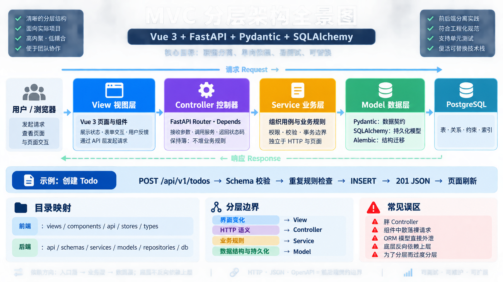

# 01｜MVC 与现代分层架构

> 目标：能看懂项目分层、让 AI 按正确职责写代码，并能在面试中解释一次请求怎样流动。

[学习首页](../README.md) · [HTTP 与 HTTPS →](./02-HTTP与HTTPS.md)



## 1. 先记住这条链路

```text
Vue 页面
  ↓ HTTP + JSON
FastAPI Router
  ↓
Service
  ↓
Repository / SQLAlchemy Model
  ↓
PostgreSQL
```

MVC 的价值不是固定文件夹，而是让不同代码只关心自己的职责。

## 2. MVC 三部分

| 部分 | 负责什么 | 当前技术栈中的近似位置 |
| --- | --- | --- |
| Model | 数据、状态和业务数据操作 | SQLAlchemy、Repository、数据库 |
| View | 用户看到和操作的界面 | Vue 页面与组件 |
| Controller | 接收输入、调用业务、返回结果 | FastAPI Router |

这是帮助理解的近似映射，不表示 FastAPI 必须机械套用传统 MVC。

现代项目通常增加 Service：

```text
Router       处理 HTTP
Service      处理业务规则
Repository   处理数据访问
Model        映射数据库结构
Schema       处理 API 输入输出
```

## 3. 一次创建 Todo 的请求

```text
1. Vue 收集 title
2. Axios POST /api/v1/todos
3. FastAPI 用 TodoCreate 校验 JSON
4. Router 调用 TodoService.create
5. Service 检查业务规则
6. Repository 保存 SQLAlchemy Todo
7. PostgreSQL 提交记录
8. TodoOut 过滤并序列化响应
9. Vue 更新页面
```

## 4. 推荐目录

```text
backend/app/
├─ api/             Router 与 HTTP 参数
├─ schemas/         Pydantic 请求和响应模型
├─ services/        业务规则
├─ repositories/    数据访问
├─ models/          SQLAlchemy 模型
└─ db/              Session 与数据库配置

frontend/src/
├─ views/           路由页面
├─ components/      可复用组件
├─ stores/          Pinia 状态
└─ api/             Axios 接口模块
```

小项目不需要一开始创建所有目录，有真实职责再拆分。

## 5. Router 应该做什么

```python
@router.post("", response_model=TodoOut, status_code=201)
async def create_todo(
    payload: TodoCreate,
    service: TodoServiceDep,
) -> Todo:
    return await service.create(payload)
```

Router 负责：

- 读取 Path、Query、Header、Body；
- 选择状态码和响应模型；
- 调用 Service；
- 把领域异常映射为 HTTP。

Router 不适合堆放 SQL、事务和大段业务判断。

## 6. Service 应该做什么

```python
class TodoService:
    def __init__(self, repository: TodoRepository) -> None:
        self.repository = repository

    async def create(self, payload: TodoCreate) -> Todo:
        title = payload.title.strip()
        if await self.repository.exists_with_title(title):
            raise DuplicateTodoError(title)
        return await self.repository.create(title)
```

Service 负责：

- 是否允许操作；
- 多步骤业务流程；
- 跨多个 Repository 的协调；
- 领域异常；
- 事务边界的业务意图。

## 7. Repository 与 Model

```python
class TodoRepository:
    async def find(self, todo_id: int) -> Todo | None:
        ...

    async def create(self, title: str) -> Todo:
        ...
```

Repository 隔离查询细节，SQLAlchemy Model 映射表和字段。

并非每个简单项目都必须创建 Repository。查询较少时，Service 使用清晰的数据访问模块也可以；重点是不要让 HTTP、业务和 SQL 混在一起。

## 8. Schema 与 Model 不同

```text
TodoCreate       客户端允许提交什么
TodoUpdate       客户端允许修改什么
TodoOut          接口允许返回什么
Todo ORM Model   数据库怎样保存
```

数据库包含某字段，不代表 API 必须返回它。用户的 `password_hash` 永远不应因为 ORM 对象存在就暴露给前端。

## 9. 常见错误

- Router 直接创建数据库 Session 并写所有 SQL；
- Service 到处抛 FastAPI `HTTPException`；
- Pydantic Schema 与 SQLAlchemy Model 当成同一种模型；
- 为了分层创建大量只做原样转发的文件；
- Vue 组件直接拼接所有接口和业务规则；
- 把分层理解为调用层数越多越专业。

判断职责时使用一句话：

```text
HTTP 变化影响 Router，业务规则变化影响 Service，存储变化影响 Repository。
```

## 10. 给 AI 的开发指令

```text
请按现有 FastAPI 项目的分层实现 Todo 创建功能。
Router 只处理 HTTP、Schema、状态码和 Service 调用。
Service 负责标题规范化、重复规则和领域异常。
Repository 负责 SQLAlchemy 查询与持久化。
分别使用 TodoCreate、TodoOut 和 ORM Todo，不要互相替代。
先阅读项目现有结构，只修改相关文件，最后运行类型检查和测试。
```

代码审查指令：

```text
请检查这次改动是否混淆 Router、Service、Repository、Schema 和 ORM Model。
优先指出业务规则散落、事务边界不清、敏感字段暴露和无意义转发层。
给出最小重构方案，不要为了形式增加目录。
```

## 11. 面试表达

> MVC 通过 Model、View、Controller 分离数据、界面和输入协调。现代前后端分离项目通常扩展为 Router、Service、Repository 等分层。

> 前后端分离与 MVC 不是同一维度。前后端分离讨论部署和通信边界，MVC 讨论代码职责组织，它们可以同时存在。

> Router 处理 HTTP，Service 处理业务，Repository 处理数据访问。这样变化被限制在对应层，也便于测试和替换实现。

> Pydantic Schema 是 API 契约，SQLAlchemy Model 是数据库映射，二者字段可能相似但职责不同。

## 12. 速查

```text
界面显示与交互       Vue
HTTP 入口与响应      Router
输入输出校验         Pydantic Schema
业务规则             Service
数据库访问           Repository
表与对象映射         SQLAlchemy Model
最终持久化           PostgreSQL
```

[进入下一课：HTTP 与 HTTPS →](./02-HTTP与HTTPS.md)
