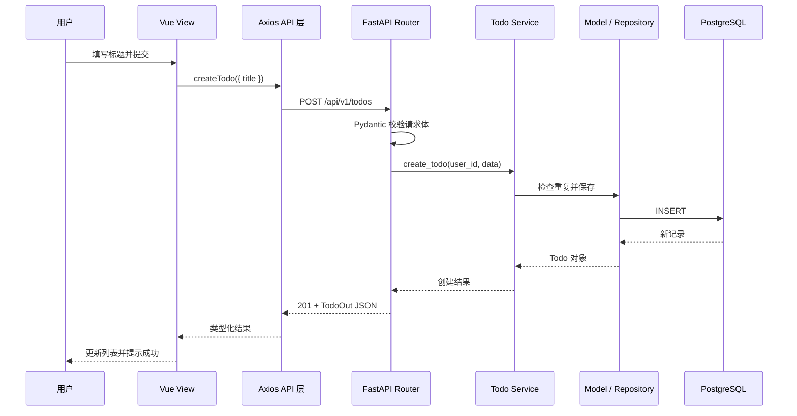

# 01｜MVC 分层架构

> 所属阶段：全栈开发学习的架构入门  
> 技术栈映射：Vue 3 + FastAPI + Pydantic + SQLAlchemy + Alembic  
> 本课目标：理解一次业务请求如何穿过各层，并能判断一段代码应该放在哪一层。

[学习首页](../README.md) · 下一课：[HTTP 与 HTTPS →](./02-HTTP与HTTPS.md)


图中最重要的是中间的双向链路：上方实线表示请求从 View 进入系统并逐层下沉，下方虚线表示处理结果逐层返回。Service 是工程实践中添加的业务层，不属于 MVC 三个字母本身，但它能避免 Controller 变得臃肿。

## 1. 先理解 MVC 要解决什么问题

假设一个 Todo 应用把下面这些代码全部写在同一个文件里：

- 接收 HTTP 请求；
- 校验标题是否为空；
- 判断任务是否重复；
- 读写数据库；
- 拼装返回数据；
- 渲染页面和处理按钮点击。

功能少时它或许能工作，但业务一增加，修改任何一处都可能影响其他部分，测试和多人协作也会越来越困难。

MVC 的核心不是“多建几个文件夹”，而是**按变化原因拆分职责**：页面显示变化时改 View，接口入口变化时改 Controller，数据结构或持久化方式变化时改 Model。

## 2. MVC 三层分别负责什么

| 层 | 核心问题 | 在本课程技术栈中的对应物 | 应该包含 | 不应该包含 |
| --- | --- | --- | --- | --- |
| Model | 数据是什么、怎样保存 | SQLAlchemy 模型、Pydantic 数据契约、Alembic 迁移 | 字段、关系、约束、持久化结构 | 页面按钮、HTTP 路由 |
| View | 用户看见什么、怎样交互 | Vue 3 页面与组件 | 展示状态、表单、事件、交互反馈 | SQL、数据库会话 |
| Controller | 请求如何进入系统、结果如何返回 | FastAPI Router、依赖注入 | 接收参数、调用业务、选择状态码和响应模型 | 大段业务规则、直接堆叠查询 |

在真实项目中，我们通常还会增加 **Service（业务层）**。因此后端常见的主链路不是机械的三层，而是：

```text
Router / Controller → Service → Model / Repository → Database
```

Service 负责“系统要做什么”，例如：

- 同一用户不能创建两个同名的未完成任务；
- 完成后的任务不能再次编辑；
- 普通用户只能查看自己的任务。

这些都是业务规则，既不属于 HTTP，也不属于某张数据表本身。

## 3. 一次请求是怎样流动的

以“创建 Todo”为例：



观察这条链路：

1. View 不知道数据库如何保存数据。
2. Router 不知道按钮长什么样。
3. Service 不依赖 Vue，也不需要知道请求来自网页还是移动端。
4. Model 不决定返回 `201` 还是 `400`，因为那是 HTTP 层的语义。

## 4. 推荐的项目目录

这是一个适合学习和中小型项目的结构，不必一开始就追求更复杂的“终极架构”。

```text
fullstack-project/
├─ backend/
│  └─ app/
│     ├─ main.py                 # FastAPI 应用入口
│     ├─ api/
│     │  └─ v1/
│     │     └─ todos.py          # Controller / Router
│     ├─ schemas/
│     │  └─ todo.py              # Pydantic 请求与响应契约
│     ├─ services/
│     │  └─ todo_service.py      # 业务规则
│     ├─ models/
│     │  └─ todo.py              # SQLAlchemy 持久化模型
│     ├─ repositories/
│     │  └─ todo_repository.py   # 可选：集中封装数据访问
│     ├─ db/
│     │  └─ session.py           # 数据库连接与会话
│     └─ core/
│        └─ exceptions.py        # 业务异常等横切能力
└─ frontend/
   └─ src/
      ├─ views/
      │  └─ TodoView.vue         # View：页面编排
      ├─ components/
      │  └─ TodoForm.vue         # View：可复用组件
      ├─ api/
      │  └─ todos.ts             # Axios 请求封装
      ├─ stores/
      │  └─ todo.ts              # Pinia 状态与异步动作
      └─ types/
         └─ todo.ts              # TypeScript 数据类型
```

`Repository` 不是 MVC 的必需部分。简单 CRUD 可以先由 Service 使用数据库会话；查询变多、数据源变复杂或需要隔离持久化细节时，再抽出 Repository。不要为了“层数多”而分层。

## 5. 用最小代码看清各层边界

以下代码强调职责，不是本课要求立即运行的完整项目。

### 5.1 Model：数据库中的 Todo

```python
# backend/app/models/todo.py
from sqlalchemy.orm import Mapped, mapped_column

class Todo(Base):
    __tablename__ = "todos"

    id: Mapped[int] = mapped_column(primary_key=True)
    title: Mapped[str]
    completed: Mapped[bool] = mapped_column(default=False)
```

这个模型描述数据库实体。它不接收 HTTP 请求，也不渲染页面。

### 5.2 Schema：接口的数据契约

```python
# backend/app/schemas/todo.py
from pydantic import BaseModel, ConfigDict, Field

class TodoCreate(BaseModel):
    title: str = Field(min_length=1, max_length=100)

class TodoOut(BaseModel):
    model_config = ConfigDict(from_attributes=True)

    id: int
    title: str
    completed: bool
```

数据库模型和接口契约要分开：数据库里将来可能有 `owner_id`、审计字段等内部信息，但接口不一定允许客户端写入或读取它们。

**<u>就是一种自定义类型</u>**

### 5.3 Service：业务规则

```python
# backend/app/services/todo_service.py
class DuplicateTodoError(Exception):
    pass

async def create_todo(session, user_id: int, data: TodoCreate) -> Todo:
    existing = await find_unfinished_by_title(session, user_id, data.title)
    if existing:
        raise DuplicateTodoError("存在同名的未完成任务")

    todo = Todo(title=data.title, owner_id=user_id)
    session.add(todo)
    await session.commit()
    await session.refresh(todo)
    return todo
```

“不能创建重复的未完成任务”属于业务规则，所以放在 Service，而不是路由函数或 Vue 组件中。

### 5.4 Controller：薄路由

```python
# backend/app/api/v1/todos.py
from fastapi import APIRouter, Depends, status

router = APIRouter(prefix="/todos", tags=["todos"])

@router.post("", response_model=TodoOut, status_code=status.HTTP_201_CREATED)
async def create_todo_endpoint(
    data: TodoCreate,
    session: AsyncSession = Depends(get_session),
    current_user: User = Depends(get_current_user),
):
    return await todo_service.create_todo(session, current_user.id, data)
```

这里的路由只负责：

1. 声明如何接收请求；
2. 取得数据库会话和当前用户；
3. 调用 Service；
4. 声明响应模型和状态码。

业务异常到 HTTP 状态码的转换可以由全局异常处理器统一完成，避免每个路由重复 `try/except`。

### 5.5 View 与前端 API 层

```ts
// frontend/src/api/todos.ts
export interface TodoCreate {
  title: string
}

export interface Todo {
  id: number
  title: string
  completed: boolean
}

export async function createTodo(data: TodoCreate): Promise<Todo> {
  const response = await http.post<Todo>('/api/v1/todos', data)
  return response.data
}
```

```vue
<!-- frontend/src/views/TodoView.vue -->
<script setup lang="ts">
import { ref } from 'vue'
import { createTodo } from '@/api/todos'

const title = ref('')

async function submit() {
  await createTodo({ title: title.value })
  title.value = ''
}
</script>

<template>
  <form @submit.prevent="submit">
    <input v-model.trim="title" placeholder="请输入任务标题" />
    <button type="submit">创建</button>
  </form>
</template>
```

关键点不是“Vue 不能写逻辑”，而是组件应主要处理**界面逻辑**。例如按钮是否禁用、弹窗是否打开属于 View；“同名任务是否允许创建”属于后端 Service。

## 6. 判断代码归属的实用方法

遇到一段代码不知道放哪时，依次问：

1. 它是否只和页面展示、输入或交互有关？是则放 View。
2. 它是否在解释 HTTP 请求、依赖和响应？是则放 Controller / Router。
3. 它是否表达业务规则，而且换成命令行客户端后仍然成立？是则放 Service。
4. 它是否描述数据结构、关系或持久化操作？是则放 Model / Repository。
5. 它是否被多层共同使用，例如日志、配置、异常？放 `core/` 等横切模块，而不是硬塞进 MVC。

## 7. 常见错误与改进

### 错误一：胖 Controller

路由里同时查询、判断权限、计算价格、写数据库，导致它难以测试和复用。

**改进：**路由保留输入输出编排，把业务规则移入 Service。

### 错误二：把 SQLAlchemy 模型直接当接口模型

这样容易把密码哈希、内部状态等字段意外返回给客户端，也让数据库结构和接口结构被迫同步变化。

**改进：**为创建、更新、输出分别定义 Pydantic Schema，例如 `TodoCreate`、`TodoUpdate`、`TodoOut`。

### 错误三：Vue 组件里到处出现裸 Axios 请求

地址、错误处理和类型会散落在多个组件中，接口一改就要全局搜索。

**改进：**请求统一封装到 `src/api/`，跨页面状态与异步动作按需要放入 Pinia。

### 错误四：只有文件夹分层，没有依赖方向

例如 Model 反过来导入 Router，或 Service 操作 Vue 的概念，表面分层但模块仍然互相纠缠。

**改进：**让依赖大体沿一个方向流动：入口层依赖业务层，业务层依赖数据能力，底层不反向依赖上层。

### 错误五：过度分层

一个只有三行的查询被拆成五个文件，每层只是原样转发，阅读成本反而增加。

**改进：**先保持 `Router → Service → Model` 清晰；只有数据访问确实变复杂时再引入 Repository。

## 8. 本课练习

### 练习 A：职责分类

把下列需求归入最合适的层：

1. “标题最多 100 个字符”的请求格式约束。
2. “同一用户不能创建两个同名未完成任务”的规则。
3. 点击按钮后显示加载动画。
4. `POST /todos` 成功时返回 `201`。
5. 为 `owner_id` 建立数据库索引。

建议先自己作答，再查看文末答案。

### 练习 B：画出链路

不看上文，写出“用户在网页完成一个 Todo”从 View 到数据库再返回 View 的完整调用链，并在每一步标注输入和输出。

### 练习 C：识别胖路由

阅读下面的伪代码，指出哪些语句应该下沉到 Service：

```python
@router.post("/orders")
async def create_order(data, session, current_user):
    product = await find_product(data.product_id)
    if product.stock < data.quantity:
        raise HTTPException(400, "库存不足")
    total = product.price * data.quantity
    if current_user.level == "vip":
        total *= Decimal("0.9")
    product.stock -= data.quantity
    order = await save_order(session, current_user.id, total)
    return order
```

提示：路由应保留 HTTP 入口职责；库存检查、价格计算、折扣和订单事务属于业务流程。

## 9. 自测问题

在进入下一课前，确保你能用自己的话回答：

- MVC 解决的主要问题是什么？
- 为什么真实后端项目常在 Controller 与 Model 之间增加 Service？
- Pydantic Schema 和 SQLAlchemy Model 为什么不应混为一谈？
- 为什么前端组件中应避免散落裸 HTTP 请求？
- “薄 Controller”具体薄在哪里？
- 新增 Repository 的信号是什么？

## 10. 验收标准

完成本课后，你应当能够：

- 说清 Model、View、Controller、Service 的职责边界；
- 根据代码的变化原因判断它属于哪一层；
- 画出 `Vue → API → Router → Service → Model → Database` 请求链路；
- 设计基础的前后端目录结构；
- 识别胖 Controller、接口模型泄漏和前端裸请求等常见问题；
- 为一个小型 CRUD 项目提出合理的分层改造方案。

## 11. 练习 A 参考答案

1. Pydantic Schema。它是接口数据契约；数据库也可以另设约束作为最终保护。
2. Service。它是独立于传输协议的业务规则。
3. View。它是纯界面交互状态。
4. Controller / Router。状态码属于 HTTP 响应语义。
5. Model / 数据库迁移。索引属于持久化结构。

## 12. 下一步

MVC 是整套技术的“地图”，不是孤立的框架。接下来按照大纲的基础层深入学习时，要持续把新知识放回这张地图：

- HTML / CSS / TypeScript 主要构成 View 的基础；
- Python 是后端 Controller、Service 与 Model 的语言基础；
- SQL 是 Model 与数据访问的底层基础；
- Vue 3、FastAPI、Pydantic、SQLAlchemy 会把各层真正实现出来；
- HTTP、JSON 与 OpenAPI 是前后端之间的契约边界。

建议学习本课后，先完成三个练习并把答案写在本文件副本或单独笔记中。下一课再进入基础技术，而不是立刻堆砌框架代码。
