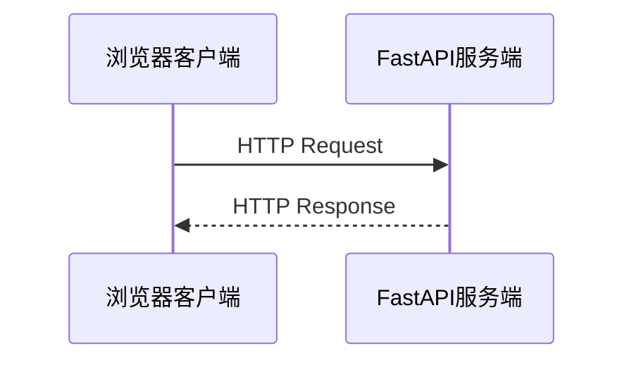

# 02｜HTTP 与 HTTPS

> 所属阶段：前后端通信基础  
> 前置知识：MVC 分层架构  
> 本课目标：能够读懂、设计、发送和排查一个完整的 HTTP 请求，并理解 HTTPS 在其中提供的安全能力。

[← MVC 分层架构](./01-MVC分层架构.md) · [学习首页](../README.md) · [JSON 数据格式 →](./03-JSON数据格式.md)

## 1. 为什么 MVC 之后先学 HTTP

上一课建立了这条调用链：

```text
Vue View → API 层 → FastAPI Router → Service → Model → Database
```

其中，Vue 与 FastAPI 并不是直接调用彼此的函数。它们通过网络交换 HTTP 请求和响应：

```text
浏览器 / Vue              FastAPI / Controller
     │                           │
     ├──── HTTP Request ────────>│
     │                           │
     │<─── HTTP Response ────────┤
```

所以 HTTP 是 View 与 Controller 之间的边界语言。以后遇到“页面拿不到数据”，首先要判断问题发生在哪一段：

- 请求有没有发出？
- URL 和方法是否正确？
- 参数放对位置了吗？
- 服务端返回了什么状态码？
- 响应体是不是预期结构？
- 是否被浏览器的 CORS 策略拦截？

## 2. HTTP 的基本心智模型

HTTP 是一种**请求—响应协议**：客户端先发起请求，服务器处理后返回响应。



一次普通请求通常经历：

1. 根据域名查询服务器地址；
2. 建立网络连接；
3. 使用 HTTPS 时进行 TLS 握手；
4. 客户端发送 HTTP 请求；
5. 服务端路由、执行业务并生成响应；
6. 客户端根据状态码、响应头和响应体处理结果。

HTTP 本身是无状态的：两次请求默认互不认识。登录状态通常通过 Cookie、Session 或 Token 等机制补充。

## 3. 一个 HTTP 请求由什么组成

下面是一个创建 Todo 的简化原始请求：

```http
POST /api/v1/todos HTTP/1.1
Host: api.example.com
Content-Type: application/json
Authorization: Bearer eyJhbGciOi...
Accept: application/json

{
  "title": "学习 HTTP"
}
```

它包含三个主要部分。

### 3.1 请求行

```text
POST /api/v1/todos HTTP/1.1
```

- `POST`：请求方法，表示这次操作的语义；
- `/api/v1/todos`：请求目标；
- `HTTP/1.1`：协议版本。

浏览器开发者工具通常不会完整显示这行原文，而是分别显示 Request Method、Request URL 等字段。

### 3.2 请求头 Headers

请求头描述请求的附加信息：

- `Host`：目标主机；
- `Content-Type`：请求体是什么格式；
- `Accept`：客户端希望收到什么格式；
- `Authorization`：身份凭证；
- `Cookie`：浏览器保存并随请求发送的数据；
- `User-Agent`：客户端信息；
- `Origin`：浏览器请求的来源，CORS 会使用它。

HTTP 头名称不区分大小写，但项目中应保持统一写法。

### 3.3 请求体 Body

请求体承载要提交的数据。上例使用 JSON：

```json
{
  "title": "学习 HTTP"
}
```

不是所有请求都需要请求体。GET 查询通常使用路径参数和查询参数，不应依赖 GET 请求体，因为很多客户端、中间件和缓存无法稳定处理它。

## 4. 一个 HTTP 响应由什么组成

创建成功时，服务端可能返回：

```http
HTTP/1.1 201 Created
Content-Type: application/json
Location: /api/v1/todos/42
X-Trace-ID: fdb22e08

{
  "id": 42,
  "title": "学习 HTTP",
  "completed": false
}
```

响应同样有三个关键部分：

1. 状态行：协议版本、状态码、原因短语；
2. 响应头：格式、缓存策略、追踪编号等元数据；
3. 响应体：真正返回给客户端的数据。

前端不能只看响应体，还要先判断状态码代表成功还是失败。

## 5. URL 的组成

观察这个地址：

```text
https://api.example.com:443/api/v1/todos/42?include=owner#detail
```

| 部分 | 示例 | 作用 |
| --- | --- | --- |
| Scheme | `https` | 使用什么协议 |
| Host | `api.example.com` | 访问哪台主机 |
| Port | `443` | 访问主机上的哪个端口；HTTPS 默认 443 |
| Path | `/api/v1/todos/42` | 定位资源或路由 |
| Query | `include=owner` | 提供查询条件或选项 |
| Fragment | `detail` | 页面内部定位，只由客户端处理，不会发送给服务器 |

注意：URL 中包含敏感信息很危险。查询参数可能被浏览器历史、代理日志、服务器日志和分析系统记录，因此密码和访问令牌不应放在 Query 中。

## 6. 请求方法与语义

| 方法 | 常见用途 | 是否安全 | 通常是否幂等 | Todo 示例 |
| --- | --- | --- | --- | --- |
| GET | 查询资源 | 是 | 是 | 获取 Todo 列表 |
| POST | 创建资源或触发操作 | 否 | 否 | 创建一个 Todo |
| PUT | 全量替换指定资源 | 否 | 是 | 完整替换 Todo 42 |
| PATCH | 局部更新资源 | 否 | 不保证 | 只修改 completed |
| DELETE | 删除资源 | 否 | 是 | 删除 Todo 42 |

### 6.1 “安全”是什么意思

安全方法表示客户端不请求改变服务器业务状态。GET 可以产生访问日志、计数等附带变化，但不应执行“删除订单”这样的业务副作用。

### 6.2 “幂等”是什么意思

同一个请求执行一次或重复执行多次，服务端的**预期最终状态**相同。

```text
PUT /todos/42  repeated → Todo 42 仍是同一份指定内容
DELETE /todos/42 repeated → Todo 42 最终都不存在
POST /todos repeated → 可能创建多条记录
```

幂等不代表每次响应必须完全相同。例如第一次 DELETE 可能返回 `204`，再次删除可能返回 `404`，但最终状态仍是“资源不存在”。

支付、下单等 POST 请求通常需要额外的幂等键，避免网络重试造成重复业务操作。

## 7. 参数应该放在哪里

### 7.1 Path 路径参数

用于标识某个具体资源：

```http
GET /api/v1/todos/42
```

这里的 `42` 是 Todo 的资源标识。

### 7.2 Query 查询参数

用于过滤、排序、搜索和分页：

```http
GET /api/v1/todos?completed=false&page=1&page_size=20
```

Query 参数通常是可选条件，不应该用来承载密码、Token 等敏感数据。

### 7.3 Header 请求头参数

用于身份、内容协商、追踪和客户端元数据：

```http
Authorization: Bearer <token>
Accept-Language: zh-CN
X-Trace-ID: fdb22e08
```

### 7.4 Cookie

Cookie 由浏览器保存，并根据域名、路径、安全属性等规则自动携带。它经常用于 Session 标识、偏好设置和某些认证方案。

### 7.5 Body 请求体

用于提交结构化数据或文件：

```json
{
  "title": "学习 HTTP",
  "completed": false
}
```

一个实用判断规则：

```text
资源身份 → Path
筛选与分页 → Query
认证与元数据 → Header / Cookie
需要创建或修改的数据 → Body
```

## 8. 常用状态码

状态码是服务端对本次请求结果的第一层说明。

### 8.1 2xx：成功

| 状态码 | 含义 | 常见场景 |
| --- | --- | --- |
| 200 OK | 成功并返回内容 | 查询、普通更新 |
| 201 Created | 成功创建资源 | POST 创建 Todo |
| 204 No Content | 成功但没有响应体 | 删除成功 |

`204` 响应不能再携带 JSON 响应体。

### 8.2 3xx：重定向与缓存

| 状态码 | 含义 | 常见场景 |
| --- | --- | --- |
| 301 | 永久重定向 | 地址永久迁移 |
| 302 | 临时重定向 | 临时跳转 |
| 304 | 资源未修改 | 协商缓存命中 |

### 8.3 4xx：客户端请求问题

| 状态码 | 含义 | 常见场景 |
| --- | --- | --- |
| 400 Bad Request | 请求无法被正确处理 | 格式或业务请求有问题 |
| 401 Unauthorized | 尚未通过身份认证 | 未登录、Token 无效或过期 |
| 403 Forbidden | 身份已知但没有权限 | 普通用户访问管理员接口 |
| 404 Not Found | 资源或路由不存在 | Todo 42 不存在 |
| 409 Conflict | 请求与当前状态冲突 | 唯一性冲突、版本冲突 |
| 422 Unprocessable Content | 请求格式可读，但字段校验失败 | FastAPI/Pydantic 校验失败 |
| 429 Too Many Requests | 请求过于频繁 | 触发限流 |

常见记忆错误：`401` 主要是“你是谁还没有被有效确认”，`403` 主要是“已经知道你是谁，但你不能做这件事”。

### 8.4 5xx：服务端问题

| 状态码 | 含义 | 常见场景 |
| --- | --- | --- |
| 500 Internal Server Error | 未被正确处理的服务端错误 | 程序异常 |
| 502 Bad Gateway | 网关收到无效上游响应 | 反向代理无法正常访问应用 |
| 503 Service Unavailable | 服务暂时不可用 | 维护、过载、依赖故障 |
| 504 Gateway Timeout | 网关等待上游超时 | 上游处理过慢或网络故障 |

前端不应把所有失败都显示成“网络错误”。应根据状态码给用户有区别的反馈，同时保留 Trace ID 供排查。

## 9. Content-Type：请求体到底是什么

### 9.1 application/json

适合普通结构化数据：

```http
Content-Type: application/json
```

```json
{
  "title": "学习 HTTP"
}
```

### 9.2 multipart/form-data

适合上传文件并同时携带表单字段。浏览器或 HTTP 客户端会自动生成分隔边界，不要手动拼接其 `boundary`。

### 9.3 application/x-www-form-urlencoded

传统 HTML 表单常用：

```text
username=alice&password=example
```

选择原则：

- 普通结构化 API 数据优先 JSON；
- 涉及文件上传使用 multipart；
- 对接传统表单或特定 OAuth2 流程时可能使用 urlencoded。

## 10. Content-Type 与 Accept 不要混淆

```http
Content-Type: application/json
Accept: application/json
```

- `Content-Type` 描述“我这次发送的 Body 是什么格式”；
- `Accept` 表达“我希望你用什么格式返回”。

如果客户端把 JSON 发送成错误的 Content-Type，服务端可能无法解析请求体。

## 11. RESTful 接口设计

RESTful 不是“URL 中不能出现任何动词”的死规则，而是一组围绕资源和 HTTP 语义组织接口的设计方式。

推荐的 Todo 接口：

| 需求 | 方法与路径 |
| --- | --- |
| 查询列表 | `GET /api/v1/todos` |
| 查询一个 | `GET /api/v1/todos/42` |
| 创建 | `POST /api/v1/todos` |
| 全量替换 | `PUT /api/v1/todos/42` |
| 局部更新 | `PATCH /api/v1/todos/42` |
| 删除 | `DELETE /api/v1/todos/42` |

设计建议：

- 资源名优先使用名词复数，如 `/todos`；
- 资源 ID 放在 Path；
- 过滤、排序和分页放在 Query；
- 使用 HTTP 方法表达通用操作；
- 使用状态码表达处理结果；
- URL 中保留版本前缀，例如 `/api/v1`；
- 确实无法自然表达为 CRUD 的业务动作可以设计成子资源或动作端点，但要保持团队一致。

不推荐：

```text
GET /getTodoList
POST /deleteTodo?id=42
POST /updateTodoCompleted?id=42
```

这些路径把动作重复写进 URL，并且可能违反 GET 不改变业务状态的约定。

## 12. HTTPS 比 HTTP 多了什么

HTTPS 可以理解为“通过 TLS 保护的 HTTP”。TLS 主要提供三项能力：

1. **机密性**：中间人难以直接读取传输内容；
2. **完整性**：传输内容被篡改时可以被发现；
3. **服务器身份验证**：客户端通过证书确认正在连接预期域名的服务器。

简化流程：

```text
客户端访问 https://api.example.com
        ↓
服务端发送证书和握手信息
        ↓
客户端检查证书链、域名和有效期
        ↓
双方协商会话密钥
        ↓
后续 HTTP 数据加密传输
```

HTTPS 不能自动解决：

- 服务端自身存在的程序漏洞；
- 用户主动把密码交给钓鱼网站；
- 接口权限设计错误；
- 数据到达服务端后的泄漏；
- 客户端设备已经被恶意软件控制。

开发环境里忽略证书错误可能方便调试，但生产环境不能把“关闭证书校验”当成解决方案。

## 13. Cookie、Session 与 Token

### 13.1 Cookie

Cookie 是浏览器侧的小段数据。常见安全属性：

- `HttpOnly`：阻止普通 JavaScript 读取，降低令牌被脚本窃取的风险；
- `Secure`：只通过 HTTPS 发送；
- `SameSite`：限制跨站携带行为；
- `Domain` 和 `Path`：限定发送范围；
- `Expires` 或 `Max-Age`：控制有效期。

### 13.2 Session

服务器保存登录状态，浏览器 Cookie 通常只保存 Session ID：

```text
Cookie: session_id=abc123
```

服务器根据 Session ID 找到用户身份。

### 13.3 Token

客户端持有令牌，请求时主动放入 Header：

```http
Authorization: Bearer <access_token>
```

Token 不等于“天然安全”。仍然需要 HTTPS、合理的过期时间、安全存储、权限检查和泄漏后的失效机制。

## 14. CORS 是什么

CORS 是浏览器实施的跨源访问规则。两个地址的协议、主机或端口只要有一项不同，就属于不同 Origin：

```text
http://localhost:5173  前端开发服务器
http://localhost:8000  FastAPI 后端
```

即使都在本机，它们仍然跨源，因为端口不同。

服务端需要返回适当的响应头，例如：

```http
Access-Control-Allow-Origin: http://localhost:5173
```

某些请求发送前，浏览器还会先发送 `OPTIONS` 预检请求。

重要边界：

- CORS 主要是浏览器安全策略；
- Postman、Apifox、curl 和后端服务之间的请求通常不受浏览器 CORS 限制；
- 请求在 Apifox 成功、在网页失败时，应优先检查浏览器控制台和 CORS 响应头；
- 允许凭证时不能随意把允许来源写成 `*`。

## 15. 缓存的基础认识

缓存可以减少重复传输，但错误缓存也会导致“明明更新了，页面还是旧数据”。

常见响应头：

```http
Cache-Control: no-cache
ETag: "todo-list-v12"
```

客户端下次可以携带：

```http
If-None-Match: "todo-list-v12"
```

资源未变化时，服务端返回 `304 Not Modified`，客户端继续使用本地副本。

需要登录的私有数据必须谨慎设置缓存范围，避免被共享缓存错误保存。

## 16. 浏览器开发者工具排查方法

打开浏览器开发者工具的 Network 面板，选择一个请求，按以下顺序检查：

1. **Request URL**：域名、端口、路径是否正确；
2. **Request Method**：GET、POST 等是否符合接口定义；
3. **Status Code**：服务端给出了哪类结果；
4. **Request Headers**：认证、Content-Type、Origin 是否正确；
5. **Query String Parameters**：筛选和分页参数是否正确；
6. **Request Payload**：请求体字段名、类型和层级是否正确；
7. **Response Headers**：Content-Type、CORS、缓存信息；
8. **Response / Preview**：服务端实际返回的数据或错误详情；
9. **Timing**：DNS、连接、等待响应分别耗时多久。

排错时不要只看前端弹出的“请求失败”。Network 面板中的原始信息才是判断依据。

## 17. 使用 curl 观察 HTTP

Windows PowerShell 中建议明确使用 `curl.exe`，避免与旧环境里的 PowerShell 别名混淆。

### 17.1 只查看响应头

```powershell
curl.exe -I https://example.com
```

### 17.2 显示请求与响应细节

```powershell
curl.exe -v https://example.com
```

### 17.3 调用本地 Todo 接口

以下命令需要未来启动本地后端后再执行：

```powershell
curl.exe -i `
  -X POST "http://localhost:8000/api/v1/todos" `
  -H "Content-Type: application/json" `
  -d '{"title":"学习 HTTP"}'
```

参数含义：

- `-i`：把响应头一起输出；
- `-X POST`：指定方法；
- `-H`：添加请求头；
- `-d`：发送请求体。

## 18. 从状态码定位问题

可以先用这张简化决策表：

```text
请求根本没有出现
└─ 检查前端事件、URL 拼接、浏览器控制台

请求出现但被浏览器拦截
└─ 检查 CORS、HTTPS 混合内容、证书

4xx
├─ 401：凭证缺失、无效或过期
├─ 403：没有权限
├─ 404：路径或资源不存在
├─ 409：资源状态冲突
└─ 422：请求字段、类型或校验规则不匹配

5xx
└─ 检查后端日志、Trace ID、数据库和上游依赖

2xx 但页面仍错误
└─ 检查响应 JSON、前端类型、状态更新和渲染逻辑
```

## 19. 常见误区

### 误区一：状态码是 200 就一定正确

业务结果、响应结构和页面处理仍可能错误。反过来，也不要把所有业务失败都包装成 `200`。

### 误区二：POST 比 GET 更安全

POST 参数不会直接显示在地址栏，但如果使用明文 HTTP，中间人仍可能看到请求体。真正保护传输的是 HTTPS。

### 误区三：幂等就是响应完全相同

幂等关注服务器的预期最终状态，而不是每次响应文字和状态码必须一样。

### 误区四：CORS 是后端接口无法访问

CORS 常常只是浏览器拒绝把响应交给网页。相同接口可能仍能被 Apifox 或 curl 正常访问。

### 误区五：前端校验后，后端就不用校验

任何人都可以绕过页面直接发请求。后端必须独立完成数据校验和权限检查。

### 误区六：HTTPS 代表网站绝对可信

HTTPS 证明连接受到保护并帮助验证域名身份，不保证网站业务本身诚实或没有漏洞。

## 20. 本课实操

### 练习 A：拆解请求

打开任意网站的开发者工具，在 Network 面板选择一个请求，记录：

- Method；
- URL 的 Scheme、Host、Path、Query；
- Status Code；
- Request Content-Type；
- Response Content-Type；
- 请求体和响应体是否存在；
- 是否使用 HTTPS。

注意不要把 Cookie、Authorization 或个人数据复制到公开位置。

### 练习 B：设计 Todo API

为以下需求写出方法、路径、参数位置和成功状态码：

1. 查询第 2 页未完成任务；
2. 查询 ID 为 42 的任务；
3. 创建任务；
4. 把任务 42 标记为完成；
5. 删除任务 42。

### 练习 C：分析故障

分别解释下面情况优先检查什么：

1. Apifox 成功，但浏览器提示 CORS；
2. 接口返回 422；
3. 接口返回 401；
4. 接口返回 403；
5. 接口返回 500，响应头含 `X-Trace-ID`；
6. POST 因超时自动重试后产生两条订单。

## 21. 练习 B 参考方案

| 需求 | 建议设计 | 成功状态码 |
| --- | --- | --- |
| 查询第 2 页未完成任务 | `GET /api/v1/todos?completed=false&page=2` | 200 |
| 查询任务 42 | `GET /api/v1/todos/42` | 200 |
| 创建任务 | `POST /api/v1/todos`，数据放 Body | 201 |
| 标记任务 42 为完成 | `PATCH /api/v1/todos/42`，Body 为 `{"completed": true}` | 200 或 204 |
| 删除任务 42 | `DELETE /api/v1/todos/42` | 204 |

状态码不是唯一可选答案，但同一个项目必须保持一致，并在接口契约中明确。

## 22. 自测问题

进入下一课前，确保你能用自己的话回答：

- HTTP 请求和响应各由哪三部分组成？
- Path、Query、Header 和 Body 分别适合放什么？
- `Content-Type` 与 `Accept` 有什么区别？
- 安全方法与幂等方法分别是什么意思？
- `401`、`403`、`404`、`409`、`422` 有何区别？
- HTTPS 提供什么能力，又不能解决什么问题？
- 为什么接口在 Apifox 成功，但浏览器仍可能失败？
- 为什么不能只依赖前端校验？

## 23. 验收标准

完成本课后，你应当能够：

- 完整拆解一个 HTTP 请求和响应；
- 正确选择 GET、POST、PUT、PATCH、DELETE；
- 按语义选择 Path、Query、Header、Cookie 与 Body；
- 根据常见状态码快速缩小故障范围；
- 为简单资源设计一致的 RESTful API；
- 解释 HTTP 与 HTTPS 的差别；
- 使用浏览器 Network 面板读取真实请求；
- 使用 `curl.exe` 查看响应头和调试请求；
- 判断 CORS、认证、权限、校验和服务端异常的基本边界。

## 24. 下一步

下一课建议学习 **JSON**。HTTP 解决“数据怎样在两端传输”，JSON 解决“传输的数据怎样组织”。掌握 JSON 后，再进入 HTML、CSS、TypeScript、Python 与 SQL 等基础层，会更容易理解这些技术如何共同组成一个全栈系统。
